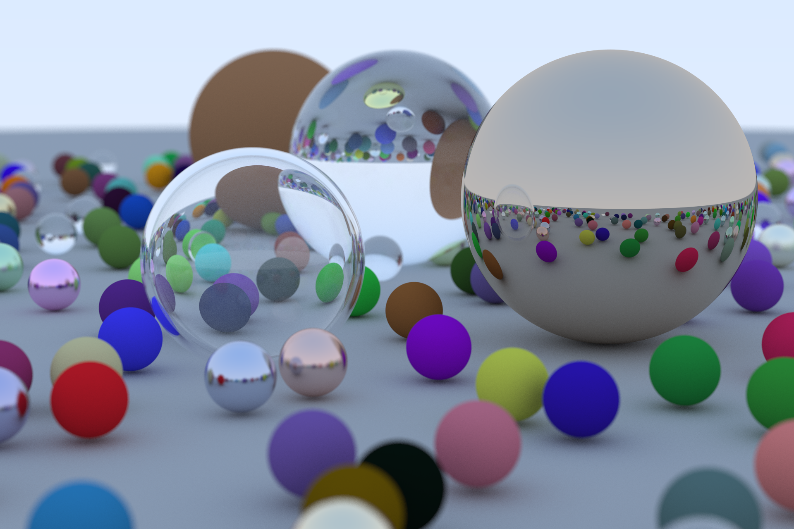
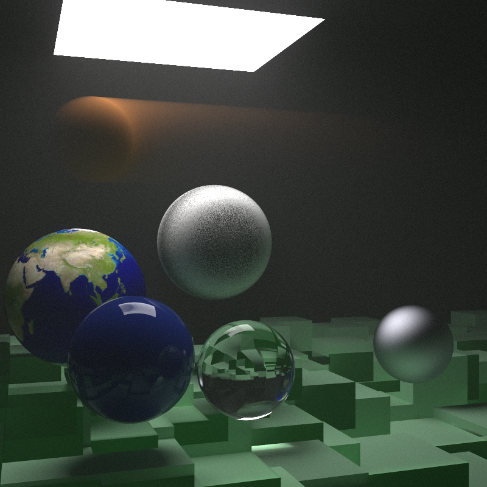

# Raytracing in a Weekend + The week after - In Rust
A simple raytracer based on the [_Ray Tracing in One Weekend_](https://raytracing.github.io/books/RayTracingInOneWeekend.html) 
and [_Ray Tracing: The Next Week_](https://raytracing.github.io/books/RayTracingTheNextWeek.html) 
by Peter Shirley, written in Rust. The raytracer uses the`image` crate to generate the image from a buffer
and `rayon` to add parallelization.

### Ray Tracing in One Weekend - Final Render


### The Next Week - Final Render



## Running
You can run the project by using cargo. It's highly recommended building a release target:

```bash 
cargo run --release
```

### Viewing renders on the fly
I've modified the rendering procedure to save the currently rendering image each time there's a new frame available. 
These frames are generated each time one ray has been traced for all available pixels in the image and will progressively 
create a final image for the number of samples per pixel that is specified in the `main.ru` file.
You can view the generating image by using e.g. `sxiv`:

```bash
sxiv output.png
```